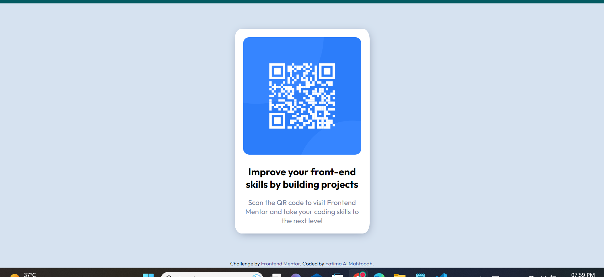

# Frontend Mentor - QR code component solution

This is a solution to the [QR code component challenge on Frontend Mentor](https://www.frontendmentor.io/challenges/qr-code-component-iux_sIO_H). Frontend Mentor challenges help you improve your coding skills by building realistic projects. 

## Table of contents

- [Overview](#overview)
  - [Screenshot](#screenshot)
  - [Links](#links)
- [My process](#my-process)
  - [Built with](#built-with)
  - [What I learned](#what-i-learned)
  - [Continued development](#continued-development)
  - [Useful resources](#useful-resources)
- [Author](#author)


**Note: Delete this note and update the table of contents based on what sections you keep.**

## Overview
This repository contains the solution of the Frontend Mentor QR code component challenge.

### Screenshot




### Links

- Solution URL: https://github.com/fatimaham2000/QRCodeCompnentSolution
- Live Site URL: https://fatimaham2000.github.io/QRCodeCompnentSolution/

## My process

1- break down component and give suitable classes name
2- design CSS for each component based on the design's reference

### Built with

- Semantic HTML5 markup
- CSS custom properties
- Flexbox


### What I learned

- How to create media query

To see how you can add code snippets, see below:


```css
@media (max-width: 375px){
    .container{
        box-shadow: 1px 5px 30px -15px hsl(220, 15%, 55%);
    }
    footer{
        padding: 2em 0;
    }
}
```


### Useful resources

- [Responsive web design -freecodecamp](https://www.youtube.com/watch?v=srvUrASNj0s&ab_channel=freeCodeCamp.org) - This helped me for creating responsive designs. I really liked this tutorial and will use it going forward.


## Author

- Website - [Fatima Al Mahfoodh](https://github.com/fatimaham2000)
- Frontend Mentor - [@@fatimaham2000](https://www.frontendmentor.io/profile/fatimaham2000)


